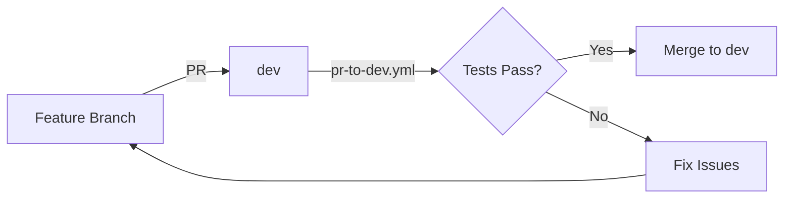
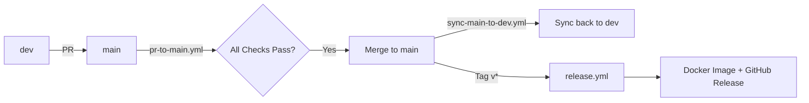

# Workflows de CI/CD - edugo-api-administracion

**Última actualización:** 2025-11-21

## 📋 Workflows Activos

### 🔄 Pull Requests

#### `pr-to-dev.yml`
**Trigger:** Pull Request → `dev`

**Propósito:** Validación de código antes de merge a dev

**Jobs:**
- Lint (golangci-lint)
- Tests unitarios
- Build
- Coverage check (threshold: 33%)

**Uso:**
```bash
# Se ejecuta automáticamente al crear PR a dev
gh pr create --base dev --head feature-branch
```

---

#### `pr-to-main.yml`
**Trigger:** Pull Request → `main`

**Propósito:** Validación completa antes de merge a main (incluye integración)

**Jobs:**
- Lint (golangci-lint)
- Tests unitarios
- Tests de integración
- Build
- Coverage check (threshold: 33%)
- Security scan

**Uso:**
```bash
# Se ejecuta automáticamente al crear PR a main
gh pr create --base main --head dev
```

---

### 🐳 Docker Builds & Releases

#### `manual-release.yml` ⭐ (Recomendado para builds manuales)
**Trigger:** Manual (workflow_dispatch)

**Propósito:** Crear release manual con control total

**Inputs:**
- `version`: Versión semver (ej: 1.5.0)
- `environment`: development | staging | production
- `push_latest`: Si actualizar tag `latest`

**Features:**
- ✅ Build Docker (amd64)
- ✅ Tags semver (1.5.0, 1.5, 1)
- ✅ Push a GHCR
- ✅ GitHub release
- ✅ Update version.txt
- ✅ Binarios compilados

**Uso:**
```bash
gh workflow run manual-release.yml \
  --field version=1.5.0 \
  --field environment=staging \
  --field push_latest=true
```

---

#### `release.yml` (Automático con tags)
**Trigger:** Tag push (v*)

**Propósito:** Release automático cuando se crea un tag

**Features:**
- ✅ Tests completos con coverage
- ✅ Build Docker (amd64)
- ✅ Push a GHCR
- ✅ GitHub release con changelog
- ✅ Binarios Linux amd64

**Uso:**
```bash
git tag -a v1.5.0 -m "Release v1.5.0"
git push origin v1.5.0
# El workflow se ejecuta automáticamente
```

**Nota:** Si `release.yml` falla, usar `manual-release.yml` como alternativa.

---

### 🔄 Sincronización

#### `sync-main-to-dev.yml`
**Trigger:** Push a `main`

**Propósito:** Mantener `dev` sincronizado con `main` después de merges

**Jobs:**
- Merge fast-forward de main a dev
- Notificación si hay conflictos

---

### 🧪 Testing Manual

#### `test.yml`
**Trigger:** Manual (workflow_dispatch)

**Propósito:** Ejecutar tests sin crear PR

**Uso:**
```bash
gh workflow run test.yml
```

---

## ❌ Workflows Deprecados

### `build-and-push.yml` (ELIMINADO - 2025-11-21)

**Razón de eliminación:**
- Funcionalidad duplicada con `manual-release.yml`
- Generaba tags Docker conflictivos
- Mantenimiento innecesariamente duplicado
- Causa confusión sobre cuál workflow usar

**Migración:**
- Para builds manuales: Usar `manual-release.yml`
- Para builds automáticos: Usar `release.yml`

**Backup disponible en:** `.github/workflows-backup/build-and-push.yml`

---

## 🎯 Flujo de Trabajo Recomendado

### Desarrollo Normal



### Release a Producción



### Release Manual (si automático falla)

```bash
# 1. Asegurar que main está actualizado
git checkout main
git pull origin main

# 2. Ejecutar release manual
gh workflow run manual-release.yml \
  --field version=1.5.0 \
  --field environment=production \
  --field push_latest=true

# 3. Monitorear workflow
gh run watch

# 4. Verificar release
gh release view v1.5.0
docker pull ghcr.io/edugogroup/edugo-api-administracion:1.5.0
```

---

## 📊 Resumen de Workflows

| Workflow | Trigger | Propósito | Duración Aprox |
|----------|---------|-----------|----------------|
| `pr-to-dev.yml` | PR → dev | Validación básica | 3-5 min |
| `pr-to-main.yml` | PR → main | Validación completa | 5-8 min |
| `manual-release.yml` | Manual | Release controlado | 8-12 min |
| `release.yml` | Tag v* | Release automático | 10-15 min |
| `sync-main-to-dev.yml` | Push main | Sincronización | 1-2 min |
| `test.yml` | Manual | Testing ad-hoc | 3-5 min |

---

## 🔑 Secrets Requeridos

| Secret | Uso | Requerido Por |
|--------|-----|---------------|
| `GITHUB_TOKEN` | Automático, access a GHCR y GitHub API | Todos |
| ~~`REPO_ACCESS_TOKEN`~~ | (Deprecado) | Ninguno |

**Nota:** Solo se usa `GITHUB_TOKEN` (automático). No se requieren secrets adicionales.

---

## 🆘 Troubleshooting

### Workflow `release.yml` Falla

**Síntomas:**
- Tag creado pero no hay release
- Docker image no se crea
- Checks fallan

**Soluciones:**
1. Verificar logs del workflow: `gh run view --log-failed`
2. Confirmar que tests pasan localmente: `go test ./...`
3. Usar `manual-release.yml` como alternativa
4. Revisar permisos de GITHUB_TOKEN (debe tener `packages: write`)

---

### Tests Fallan en CI pero Pasan Localmente

**Causas comunes:**
- Diferencia en versión de Go
- Race conditions no detectadas localmente
- Dependencias faltantes

**Solución:**
```bash
# Ejecutar tests como en CI
go test -v -race ./...

# Verificar versión de Go
go version  # Debe ser 1.24 (o la especificada en workflows)
```

---

### Docker Image No Aparece en GHCR

**Verificar:**
1. Workflow completó exitosamente
2. Permisos de packages están configurados
3. Login a GHCR funciona:
```bash
echo $GITHUB_TOKEN | docker login ghcr.io -u USERNAME --password-stdin
```

---

## 📚 Referencias

- [GitHub Actions Docs](https://docs.github.com/en/actions)
- [Docker Build Push Action](https://github.com/docker/build-push-action)
- [Go Setup Action](https://github.com/actions/setup-go)

---

**Mantenido por:** EduGo Team
**Generado con:** Claude Code
**Sprint:** SPRINT-2 - Tarea 2.2
